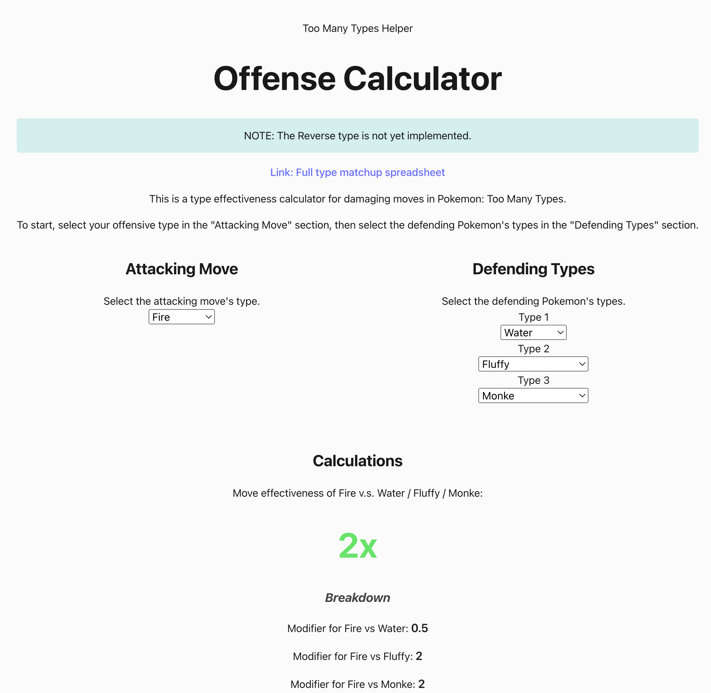

### **NOTE**: I'm happy to share this repository for people to learn and enjoy. However, please don't fork and re-deploy this without my permission, and please don't delete my name from the credits footer. Thanks!

---

# Pokemon: Too Many Types Helper

This is a helper tool for Pokemon: Too Many Types!

> Check it out here: [Too Many Types Helper](https://too-many-types-checker-v1-0-0.surge.sh/)

## Current Features

-   **Offensive Type Checker**: Check the type effectiveness of your move against any combination of defensive types!

## Planned Features

TBD!

### More information

-   This app was deployed using surge!
